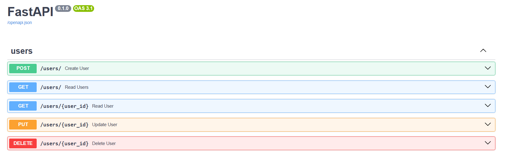
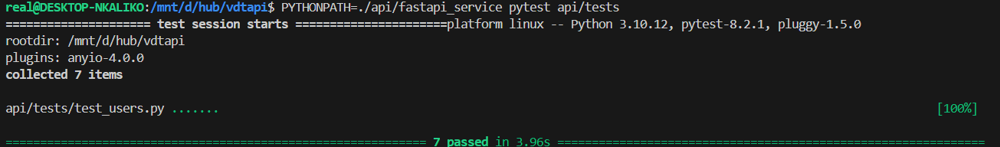
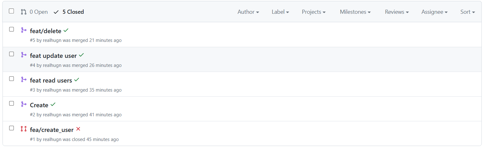
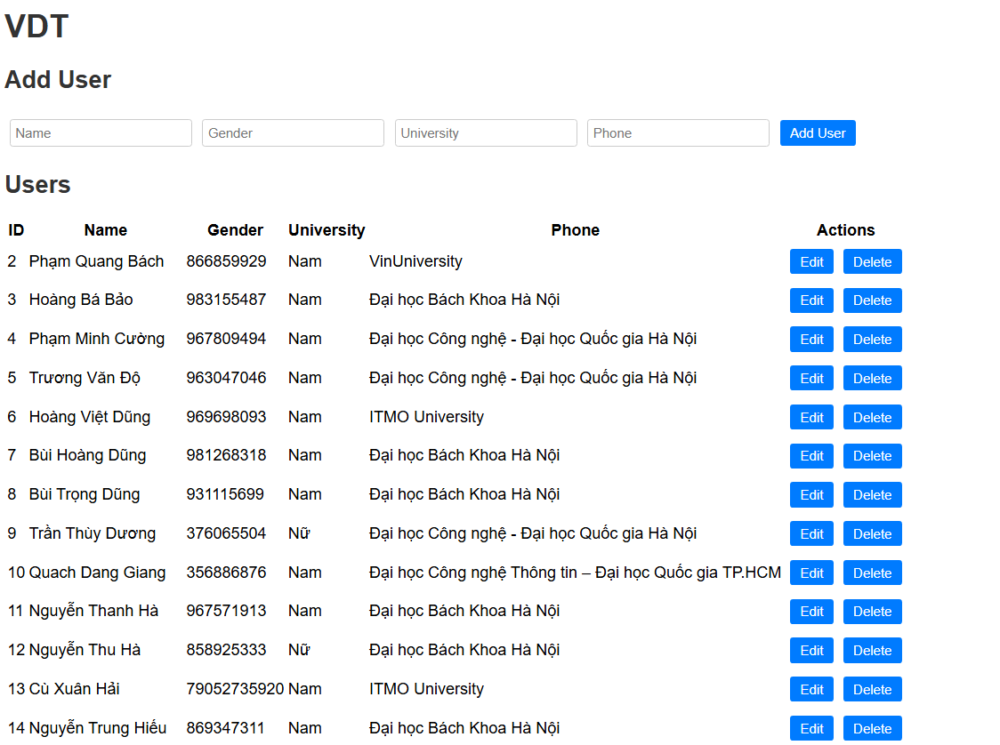
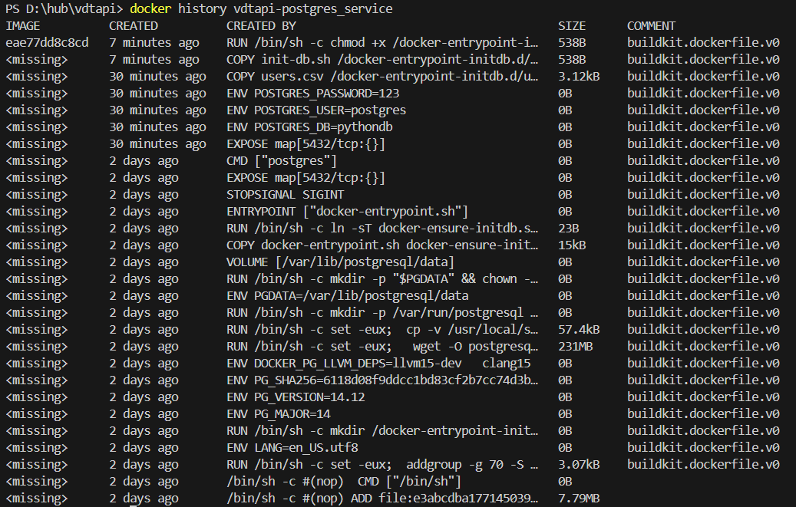
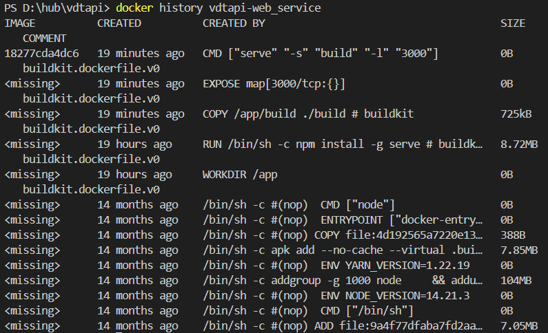
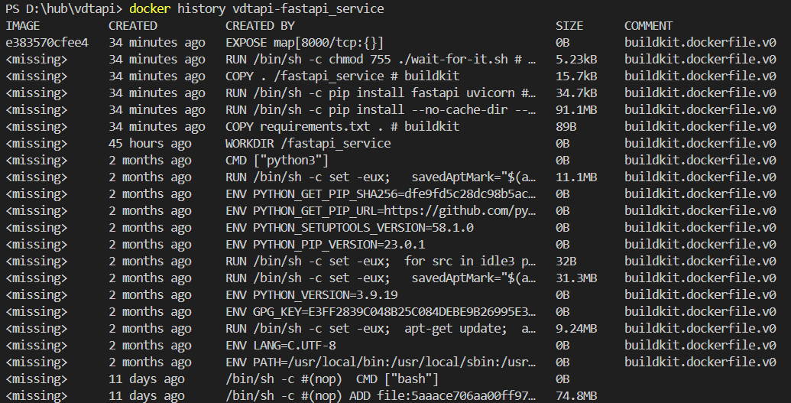
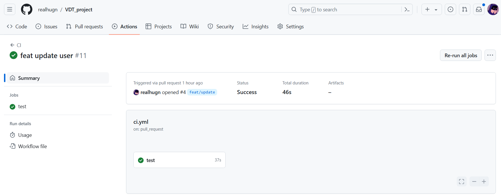
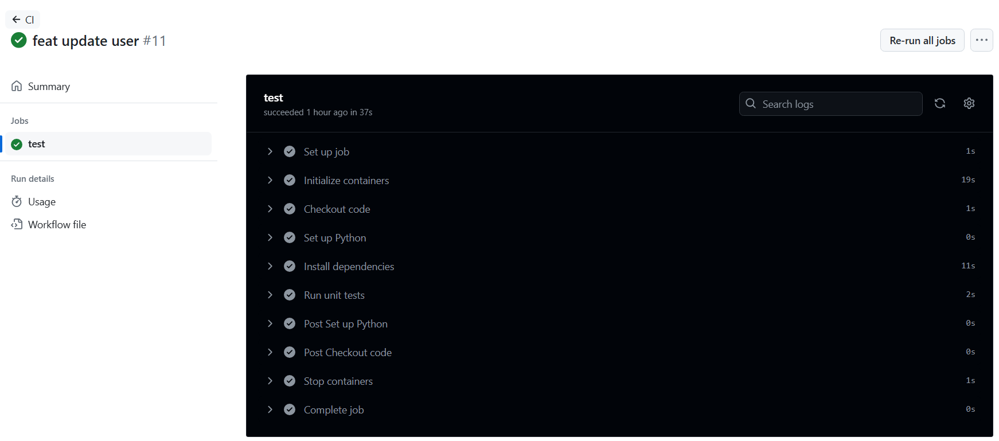
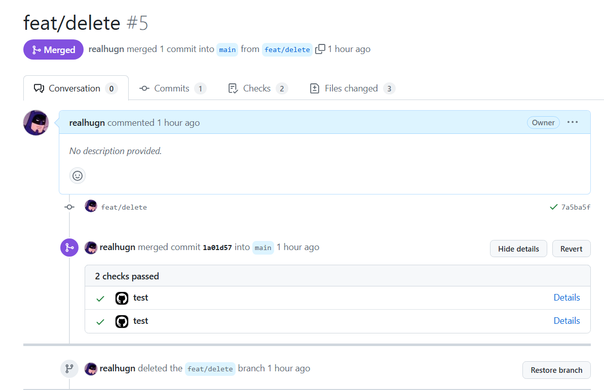

# Bài tập lớn giữa kỳ chương trình VDT 2024 lĩnh vực Cloud

## Phát triển một 3-tier web application đơn giản 
[Source Code](https://github.com/realhugn/VDT_project)
### API
#### Enpoint
- `GET /users/` : Get All Users
- `GET /users/{id}`: Get An User
- `POST /users/` : Create User
- `PUT /users/{id}`: Update User
- `DELETE /users/{id}`: Delete User
 

#### Unit Test

#### Pull Request

### DB
- Postgres
### Web
- React

## Triển khai web application sử dụng các DevOps tools & practices

1. <b>Containerization</b>
 
File Dockerfile cho từng dịch vụ:
- [web](web/Dockerfile)
- [db](db/Dockerfile)
- [api](api/fastapi_service/Dockerfile)

 
Output câu lệnh build và thông tin docker history của từng image

  <i>Pic. 1 - Postgres image docker history</i>

  <i>Pic. 2 - Web image docker history</i>

  <i>Pic. 3 - Api image docker history</i>

2. <b>Continuous Integration</b>
 

- [File setup công cụ CI ](.github/workflows)
- Output log của luồng CI

- Các hình ảnh demo khác

